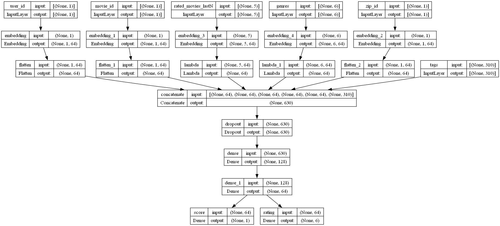

# Deep Neural Networks for YouTube Recommendations

## Introduce
本项目只实现了论文中的排序模型，召回模型同理。项目核心代码都在".py"文件中，所有".ipynb"中的代码只用作演示和单元测试，独立于业务。项目做了一些扩展，例如不定长多值序列特征的embedding（例如用户评分电影序列），简单多目标学习（例如预测评分分数和评分分类）。  
This project only implements the ranking model in the paper for demonstration, and the recall model is the same.All core codes are in the ".py" files, and the ".ipynb" scripts are only used for Unit Test and demonstration purposes.Easy to join Attention in the future, this project has made some extensions on the ranking model in the paper, such as Multi values Embedding (such as "rated_movies_lastN" feature) and Simple Multi-Task learning.  

Paper：https://dl.acm.org/doi/abs/10.1145/2959100.2959190  
DataSet: [ml-1m(movie rating)](https://grouplens.org/datasets/movielens/1m/)  

## Model & Model Trainning
[加载数据(Load Datasets)](https://github.com/solidglue/DNN_for_YouTube_Recommendations/blob/main/datasets/datasets_test.ipynb)  
[构造样本(Create Samples)](https://github.com/solidglue/DNN_for_YouTube_Recommendations/blob/main/sample/ml1m_sample_tfrecord_test.ipynb)  
[模型训练(Modle Trainning)](https://github.com/solidglue/DNN_for_YouTube_Recommendations/blob/main/core/trainner/trainner_cpu_test.ipynb)  
[保存模型与签名(Save Modles)](https://github.com/solidglue/DNN_for_YouTube_Recommendations/blob/main/core/trainner/trainner_cpu_test.ipynb)  
[模型推理(Modle Inference)](https://github.com/solidglue/DNN_for_YouTube_Recommendations/blob/main/core/infer/infer_test.ipynb)  
[main.py](https://github.com/solidglue/DNN_for_YouTube_Recommendations/blob/main/main.py)  

## Ranking model in the paper
Deep ranking network architecture  
  

## Ranking model in this project
Simple Multi-Task learning  ranking network architecture  
  
