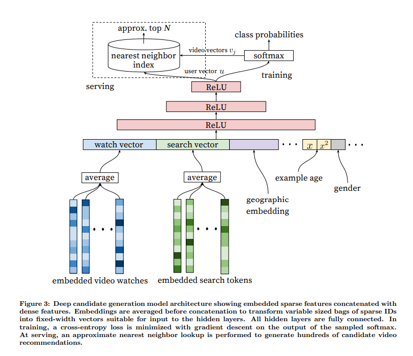

# Deep Neural Networks for YouTube Recommendations

Paper：https://dl.acm.org/doi/abs/10.1145/2959100.2959190
dataset:ml-1m,movie rating
说明：所有的核心代码都在.py文件中，.ipynb脚本只作为单元测试和辅助学习使用。
extend: 多值embedding，序列特征

updating...

## Deep candidate generation model architecture

## Deep ranking network architecture

## Multi-Task Model base on YouTuBeDNN model and ml-1m dataset

